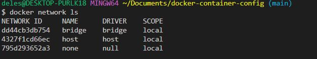

### DOCKER CONTAINER NETWORKING
---
How containers share resources and send messages to one another
Three networks are created for Docker upon installation
1.  Bridge Network (Most commonly used) - This is the default network for containers to connect to. Each container in the network is assigned a unique IP address. This allows containers in the same network to communicate.

2. None Network - No IP address is assigned. Other containers including the default bridge network  will not be able to communicate with it and vice versa.

3. Host Network - Containers on this network share the network with and connect directly with the host
4. User defined private networks - Set up a connection between a handful of containers.
Also has a embedded DNS Server which translates a container name to a unique IP address.
Needs network drivers. 
### List default networks
```
docker network ls
```

