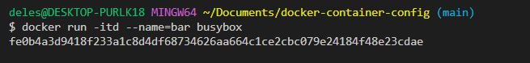

### DOCKER CONTAINER NETWORKING
---
How containers share resources and send messages to one another
Three networks are created for Docker upon installation
1.  Bridge Network (Most commonly used) - This is the default network for containers to connect to. Each container in the network is assigned a unique IP address. This allows containers in the same network to communicate.

2. None Network - No IP address is assigned. Other containers including the default bridge network  will not be able to communicate with it and vice versa.

3. Host Network - Containers on this network share the network with and connect directly with the host
4. User defined private networks - Set up a connection between a handful of containers.
Also has a embedded DNS Server which translates a container name to a unique IP address.
Needs network drivers. 
### List default networks
```
docker network ls
```


### Let's run 2 containers from busybox for testing
```
docker run -itd --name=foo busybox 
```


### Run again but give a different name
```
docker run -itd --name=bar busybox
```


```
docker container ls
```


### Check the networks on the bridge network
```
docker network inspect bridge
```


### We will make a note of the container ipV4 addresses
- foo  172.17.0.2/16

- bar  172.17.0.3/16


### Let's see if we can ping bar from foo
```
docker attach foo
```
### Tis will take us into the foo containers CLI
```
ping 172.17.0.3
```


### This proves that our 2 containers can communicate on the bridge network

---
### LET'S CREATE A PRIVATE NETWORK
```
docker network create privatenw
```
```
docker network ls
```


### The private network also uses a bridge network driver
### This means that the containers in this private network get assigned IP addresses.


docker run --network=privatenw -ltd --name=baz busybox