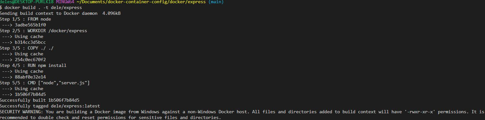
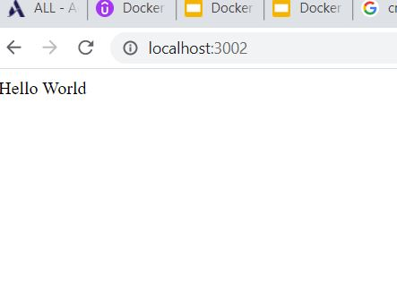

### DOCKER
-- A Docker container is a loosely isolated environment running withing a host machine's kernel allowing us to run application specific code.


### KERNEL
-- A piece of software at the core of the operating system and controls intercation between all software and the CPU.

### CPU
-- Core circuitry that executes all instructions
-- Docker runs on top of an original machine's kernell making it the HOST MACHINE

### DOCKER ENGINE
-- The Docker engine concists of the following
- The server also called Docker Daemon
- The API
- CLI

The user through the CLI talks to the Daemon who uses the blueprint to construct containers on top of a host machines kernel


### DOCKER CONTAINER ENVIRONMENT (CONTAINER)
-- Loose Isolation - Processes/running instances of one container cannot affect processes of another

-- We can set limits on resource allocation such as memory,CPU . This helps to control amount of the host kernels resources(Memory, CPU) they can consume.

-- We run application specific code. We can run an application with all its libraries and dependencies in that isolated environment. 
- This means that there is no need to install any of the dependencies on the host machine.
- The container has it's own file system.


---

---
### WHY USE CONTAINERS?
- Portability to multiple operating system environments - Docker ensures that the application can run the same way regardless of the operating system environment it is running on.
The only requirementis that the host machine has Docker installed.

- Less time setting up the environment for Developers and Engineers. More time can be spent on application specific code that drives value for them and theircompanies.
Ensures that engineers have access to the same code, code libraries and dependencies.

- Containers can be used in Development, continuous intergration and deployment environments.

---
---

### CONTAINERS VS VIRTUAL MACHINES
---
- File system in Docker containers is shared but not in virtual machines.
2GB image software on 5 virtual machines is 10GB.  5 Containers can share resources due to the shared file system hence less impact on host machine's available space.

### HOW ARE DOCKERS CONTAINERS CREATED?
-- They are created from Docker Images.
---
# .
---
###   DOCKER IMAGES
-- Read only templates with instructions for creating a Docker container. It defines everything that the container needs. It defines the following:
- Container code
- libraries
- environment variables
- configuration files ( resource allocation, networking, security etc)
- anything else the application needs to run in isolation
- The instructions are collected within an executable package whichbis the image itself. When you run the package, the container is created.

- From the image, you can create many instances of the container.


Go to https://hub.docker.com/explore to see most used docker images


### DOCKER ON THE COMMAND LINE
-- Search for image such as an Ubuntu Image
```
docker search ubuntu
```


### Create an Ubunti Image
```
docker create --name="foo" -it ubuntu bash
```
i = interactive
t  = terminal/tty


### View containers
#### Non running containers

```
docker container ls -a
```

#### View running containers
```
docker container ls
```


### Let's start the container with the foo command.
```
docker start foo
```

### Now, let's attach to our container
```
docker attach foo
```
### Now we can access the containers file system  root@0c9fdb1459b2:/# ls

```
root@0c9fdb1459b2:/# ls
```


### Let's install ping program on our container file system. We shall first update then install iputils-ping

```
apt-get update
```
```
apt-get install iputils-ping
```
### Check container logs and last operations by running --  docker logs containername from powershell(outside container CLI)
```
docker logs foo
```
### REMOVING OUR CONTAINER
-- we must stop a container before we can remove it

```
docker stop foo

docker rm foo
```
### To force remove a container
```
docker rm -f imagename
```

### WE CAN BECOME MORE EFFICIENT BY COMBINING COMMANDS
## docker run to create and start
```
docker run --name="dele" -it ubuntu bash
```
-- docker saves a cache of an image even when removed. This is very helpful as it uses this cache and speeds up the creation of subsequent containers using these images


---
## DOCKER IMAGES IN DEPTH
---
-- A read only template woth instructions for creating a Docker container
-- These instructions are defined in a DOCKERFILE

### CREATING YOUR FIRST DOCKER FILE AND IMAGE
-- CREATE A SIMPLE NODE.JS APPLICATION THAT CONSISTS OF A NODE WEBSERVER WEB PAGE THAT SAYS HELLO WORLD

### We create a folder express in our docker directory and create 3 files in the express directory
- server.js
- dockerfile
- package.json

```
mkdir docker/express
```
```
cd express
```
```
touch Dockerfile package.json server.js
```

### server.js is the entry point
```
const express = require('express');
const app = express();
HOST = '0.0.0.0';
const PORT = 80;

app.get('/', (req,res)=>{

res.send('Hello World');
});
app.listen(PORT,HOST);
console.log('Running on http://${HOST}:${PORT}');
```

### package.json is for the dependencies
```
{
    "dependencies":{

       "express": "^4.16.1" 
    }
}
```

### our dockerfile is as follows:

```
FROM node
WORKDIR /docker/express
COPY ./ ./
RUN npm install
CMD ["node","server.js"]
```
### Let's build our docker image
```
docker build . -t dele/express
```


### The next step is to run our container

```
docker run --name=express -p=3002:80 dele/server
```


end of project
```
docker stop express
```
```
docker rm express
```
### End

