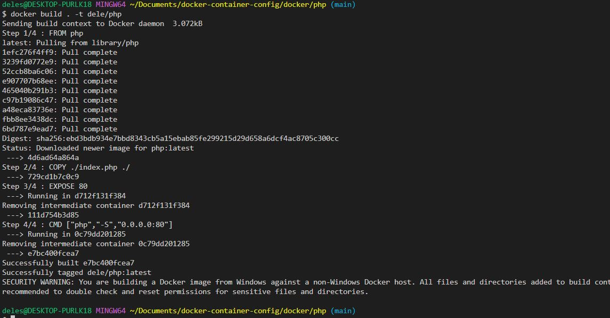

mkdir php

cd php

touch Dockerfile index.php
### index.php
```
<html>

<?php echo"This is saying hello world from a PHP container" ?>

</html>
```


### Dockerfile
```
FROM php
COPY ./index.php ./
EXPOSE 80
CMD ["php","-S","0.0.0.0:80"]
```

```
docker build . -t dele/php
```
```
docker run --name=php -p=3002:80 dele/php
```

# container ran successfully

