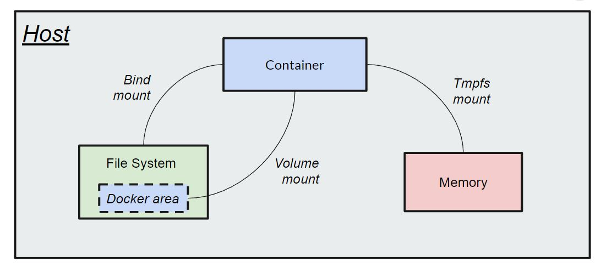

### 3 Tupes of docker container storage
- Volume mount - Dedicated portion of host machine. Managed completely by Docker and only accessible by the Docker engine and it's processes.
Works accross multiple containers and persists data on the host disk.
- Bind mount - Directly link directories on the Docker host to the container
- Tmpfs mount - Connects to the container memory and not host memory


# DOCKER VOLUME
### Create volume
```
docker create <volumename>
```

