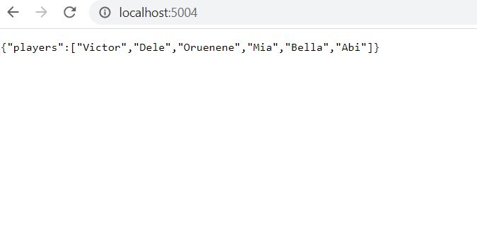

## Multi Container App with Docker Compose
---
Backend: NodeJS and Express 
It will serve an array of player name strings for different sports (Basketbal, Volleball,soccer) served by Node and Express API

Frontend: PHP _ Static website to render our API's as HTML
### Create node-php folder for project
```
docker/node-php
```
### Navigate to node-php folder
```
cd docker/node-php
```
### Create file docker-compose.yml

```
touch docker-compose.yml
```
### we create a folder players for the backend service
```
mkdir players
```
### And create the  following files in it
```
 touch players/package.json players/Dockerfile players/server.js
 ```

### In docker-compose.yml
```
version: "3"

services: 
   players:
     build: ./players
```
### In server.js

```
const express = require('express');
const app = express();
// Set host to default node host to accept all connections
const HOST = '0.0.0.0';
const PORT = 80;

// we shall now create an endpoint

app.get('/', (req, res) => {

 res.json({

   players: ['Victor','Dele','Oruenene','Mia','Bella','Abi'] 
 });
   

});

app.listen(PORT, HOST);
console.log(`Listening on http://${HOST}:${PORT}`);
```

### package.json
```
{
    "dependencies": {

"express" : "^4.16.1"
      }
}
```

### I had a problem where changes to server.js did not render after running docker-compose

### Solution: I had to force recereation using: 
```
docker-compose up --build --force-recreate
```

### Browser output 
